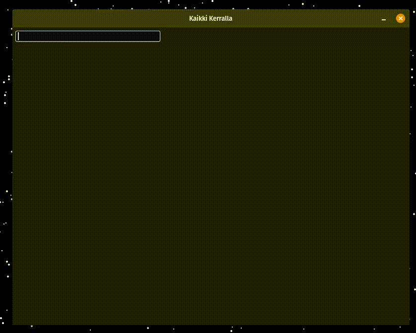

# Kaikki Kerralla

> [*kaikki*](https://kaikki.org/) &mdash; all, everything, everyone;
> [*kerralla*](https://kaikki.org/dictionary/Finnish/meaning/k/ke/kerralla.html)
> &mdash; at one time, in one go, at once

Kaikki Kerralla is a minimal and performant local dictionary tool built on the
[Kaikki Wikitionary scrapes](https://kaikki.org/).

<Center></center>

I wanted a tool that would let me look up words instantly, for realtime
on-the-fly use cases, such as mid-conversation, or when actively watching
content in a foreign language. Using more formal dictionary websites, I felt
things like network delays fairly heavily, and many tools it felt like didn't
have a great layout. This is an experiment in making dictionary lookups as
efficient as possible. One tool that was quite inspirational for the UI was
[openrussian.org](https://en.openrussian.org/), which *does* have a fairly
low-latency fuzzy search interface on each keypress. I simply wanted it for
other languages, too.

This is very minimal compared to most any other dictionary. If you need
something like this, you probably have a very special use case. Some options to
consider for more general use cases are
[VocabSieve](https://github.com/FreeLanguageTools/vocabsieve/?tab=readme-ov-file),
[Yomitan](https://github.com/yomidevs/yomitan), and
[GoldenDict](http://www.goldendict.org/).

## Installation

Install a Kaikki dictionary and place it in the `data` directory. It will be
autodetected and an index will be built on application startup.

Like most of the Rust ecosystem, this tool is built with
[Cargo](https://www.rust-lang.org/).

```bash
$ cargo run --release
```

## Contributing

Pull requests are welcome. For major changes, please open an issue first to
discuss what you would like to change.

## License

[MIT](https://choosealicense.com/licenses/mit/)
